 

  

### 🛠️ Tech Stack

 

### 📊 Live Stats
<!-- ORIGINAL — already in your README, kept as-is -->

  

<!-- ============================================================ -->
<!-- OPTION 1 — Activity Graph (line-chart contribution history)   -->
<!-- Zero setup. Just an image URL, same as your stats above.     -->
<!-- Delete this whole block if you don't want it.                -->
<!-- ============================================================ -->

### 📈 Contribution Activity Graph

 

<!-- ============================================================ -->
<!-- OPTION 2 — Profile Summary Cards                              -->
<!-- Multi-panel: stats / most-commit-language / languages / repos-->
<!-- / productive-time. Pick the panels you want in the "panels=" -->
<!-- param, or keep all five like below.                          -->
<!-- Zero setup, image URL only.                                  -->
<!-- ============================================================ -->

### 🧩 Profile Summary Cards

<!--
  "productive-time" is the standout here — almost no one adds it.
  It shows the hours/days you actually commit the most.
  utcOffset=4 is set for Dubai (UTC+4) — change if that's not your timezone.
-->

 

<!-- ============================================================ -->
<!-- OPTION 3 — 3D Contribution Calendar                           -->
<!-- Turns your flat contribution grid into an isometric 3D chart. -->
<!-- REQUIRES SETUP: a GitHub Action that runs on your account     -->
<!-- (see instructions below the README).                          -->
<!-- ============================================================ -->

### 🧊 3D Contribution Calendar
<!-- ⚠️ Currently shows broken image — this is EXPECTED. This image doesn't -->
<!-- exist yet because it's generated by a GitHub Action that hasn't run.  -->
<!-- Add the workflow below, run it once, then this will render for real. -->

 

<!-- ============================================================ -->
<!-- OPTION 4 — Contribution Snake                                 -->
<!-- Animated snake that "eats" your contribution graph, one       -->
<!-- square at a time, and updates every 12 hours.                 -->
<!-- REQUIRES SETUP: a GitHub Action (see below).                  -->
<!-- ============================================================ -->

### 🐍 Contribution Snake
<!-- ⚠️ Currently shows broken image — this is EXPECTED. Same reason as     -->
<!-- above: this SVG is generated by a GitHub Action, not a live URL.      -->
<!-- Add the workflow below, run it once, then this will render for real.  -->

 

<!-- ============================================================ -->
<!-- OPTION 5 — WakaTime Weekly Coding Metrics                     -->
<!-- Real language / editor / OS time breakdown from your actual   -->
<!-- coding sessions (not just commits).                           -->
<!-- REQUIRES SETUP: free WakaTime account + API key + Action.     -->
<!-- ============================================================ -->

<!--START_SECTION:waka-->
<!--END_SECTION:waka-->

<!-- This block is intentionally EMPTY right now — no fake numbers.   -->
<!-- Once you connect a free WakaTime account + add the Action below, -->
<!-- it auto-fills with YOUR real coding-time data on the next run.   -->
<!-- Until then, leave it empty or delete this whole section.         -->

